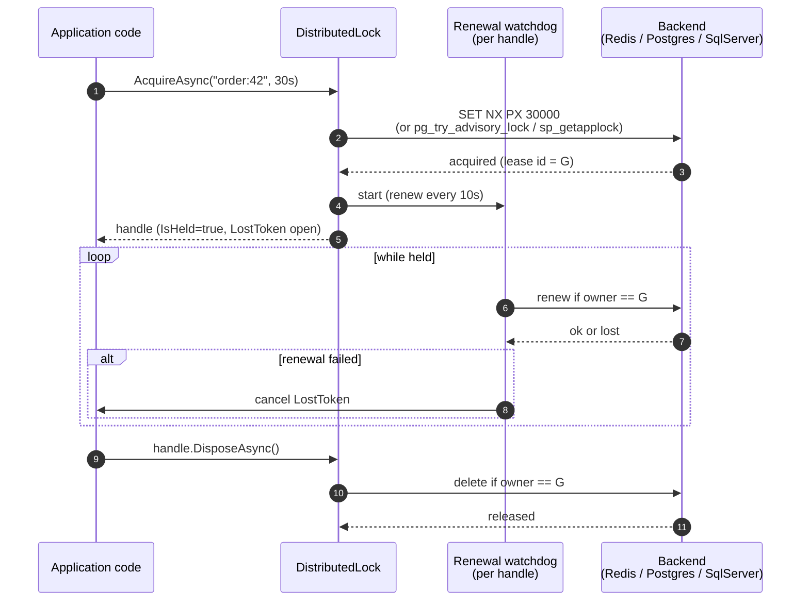
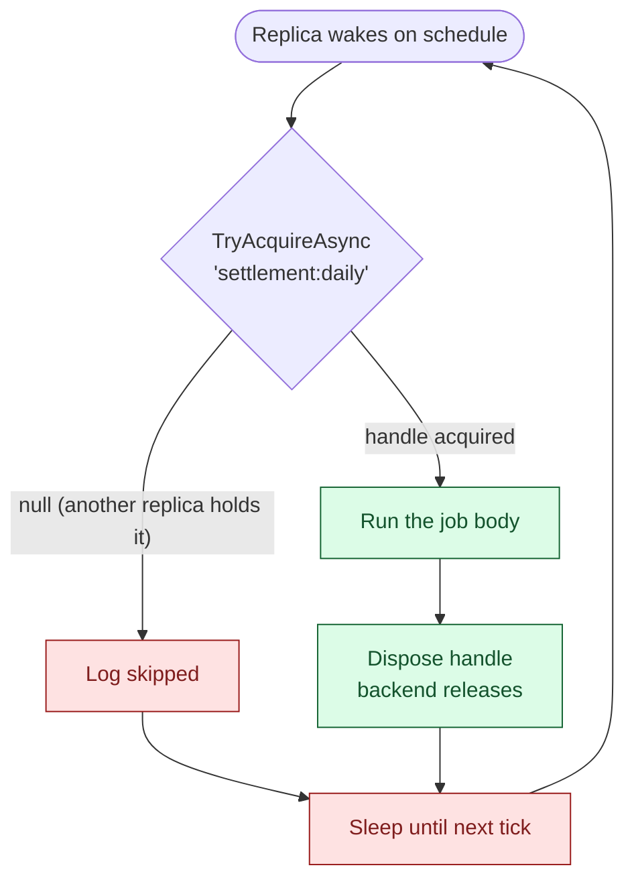

<p align="center">
  
</p>

<h1 align="center">OrionLock</h1>

<p align="center">
  Distributed locking for .NET. A backend-agnostic IDistributedLock with reentrancy, shared/exclusive (reader-writer) locks, and background lease auto-renewal.
</p>

<p align="center">
  <a href="https://www.nuget.org/packages/OrionLock"></a>
  <a href="https://www.nuget.org/packages/OrionLock"></a>
  <a href="LICENSE.txt"></a>
  
</p>

---

## How it works

The acquire path is a single backend call with a generated lease id; the release path validates ownership before deleting the row so two processes cannot accidentally release each other's locks. Between the two, a watchdog renews the lease at one-third of `LeaseDuration` and trips `handle.LostToken` if renewal fails.



The same pattern fits the "single-instance hosted job" recipe: a background service tries to claim a well-known key on its schedule, runs the work if it wins, and goes back to sleep if another replica got there first. Postgres advisory locks make this especially clean because the lock is auto-released on session end if the holding process crashes.



## Quick start

```bash
dotnet add package OrionLock
dotnet add package OrionLock.Redis           # or OrionLock.EntityFrameworkCore
```

```csharp
services.AddOrionLock()
        .UseRedis("localhost:6379");
```

```csharp
await using var handle = await locker.AcquireAsync("order:42", TimeSpan.FromSeconds(30));
// critical section - handle.LostToken trips if the lease is lost mid-section
```

## Acquire vs TryAcquire

- `AcquireAsync` blocks up to `WaitTimeout` (default 10s), retrying every `RetryInterval` (default 250 ms). Throws `LockAcquisitionTimeoutException` if it cannot acquire.
- `TryAcquireAsync` is a single attempt. Returns `null` immediately if the lock is held.

## Lease and renewal

Each acquired lock carries a lease (default 30s). A background watchdog renews the lease at `LeaseDuration / 3` while the handle is alive. If renewal fails, `handle.IsHeld` flips to false and `handle.LostToken` is cancelled — so the critical section can observe and abort safely instead of running without the lock. See [docs/lease-and-renewal.md](docs/lease-and-renewal.md).

## Reentrancy

A single `DistributedLock` instance (a DI singleton) re-acquiring a key it already holds returns a counted nested handle without touching the backend. The outermost dispose releases. Reentrancy collapses same-process re-acquisition only; it does not cross process boundaries.

## Shared / exclusive (reader-writer) locks

Added in v0.4.0. `ISharedExclusiveLock` is a reader-writer lock for a resource key: any number of `Shared` (read) holders coexist, OR exactly one `Exclusive` (write) holder owns it. Acquire, `WaitTimeout`/`RetryInterval`, lease and renewal, release, and diagnostics semantics mirror the exclusive `IDistributedLock`, and every acquire returns the same `IDistributedLockHandle`.

`UseInMemory()` from `OrionLock.Testing` registers `ISharedExclusiveLock`, so it resolves from DI like the exclusive lock:

```csharp
var rwLock = serviceProvider.GetRequiredService<ISharedExclusiveLock>();

// Many readers can hold the key at once.
await using (var read = await rwLock.AcquireSharedAsync("catalog:42"))
{
    // shared critical section - read.LostToken trips if the lease is lost
}

// A single writer excludes all readers and other writers.
await using (var write = await rwLock.AcquireExclusiveAsync("catalog:42"))
{
    // exclusive critical section
}
```

Blocking `AcquireSharedAsync` / `AcquireExclusiveAsync` wait up to `WaitTimeout` and throw `LockAcquisitionTimeoutException` on timeout. The non-blocking `TryAcquireSharedAsync` / `TryAcquireExclusiveAsync` make a single attempt and return `null` when the key is held in a conflicting mode.

As of v0.4.2, Redis is the first distributed backend for the reader-writer lock. `UseRedisSharedExclusive()` registers `ISharedExclusiveLock` over Redis, additive to the exclusive-only `UseRedis()`:

```csharp
services.AddOrionLock()
    .UseRedis("localhost:6379")        // exclusive IDistributedLock
    .UseRedisSharedExclusive();        // reader-writer ISharedExclusiveLock
```

The Redis provider keeps a Lua-scripted writer marker, a per-reader sorted set scored by lease expiry (so one reader's expiry never frees another's), and a lease-bounded pending-writer marker that holds off new readers so a waiting writer is not starved. See the `OrionLock.Redis` backend note below. The other distributed backends (EntityFrameworkCore, Postgres, SqlServer, Consul, Etcd, ZooKeeper) keep the exclusive lock only; the relational reader-writer provider is the next milestone. See the runnable section in `demo/Moongazing.OrionLock.Demo`.

## Backends

- **`OrionLock.Redis`** — `SET NX PX` acquire, owner-checked Lua renew/release. Single Redis endpoint (single-instance lock; multi-master RedLock is post-0.1). As of v0.4.2 also ships the distributed reader-writer lock (`UseRedisSharedExclusive()`): a Lua-scripted writer marker plus a per-reader sorted set scored by lease expiry, with a lease-bounded pending-writer marker for writer fairness.
- **`OrionLock.EntityFrameworkCore`** — provider-agnostic `OrionLock_Locks` table; PostgreSQL, SQL Server, MySQL, SQLite. See [docs/migrations/orionlock-locks-table.md](docs/migrations/orionlock-locks-table.md).
- **`OrionLock.SqlServer`** — native `sp_getapplock` with session-scope lifetime. Crash-safe (no clock-based expiry; SQL Server releases the lock when the session ends) and faster than the EF Core lock table on SQL Server.
- **`OrionLock.Postgres`** — native `pg_try_advisory_lock` with session-scope lifetime. Crash-safe with the same rationale as SqlServer.
- **`OrionLock.Testing`** — in-memory provider for tests, no Redis or DB required.

## Health checks

`Moongazing.OrionLock.HealthChecks` ships an `IHealthCheck` that probes backend reachability by acquiring and releasing a sentinel lock. Register it via `services.AddHealthChecks().AddOrionLockHealthCheck(name: "orionlock", failureStatus: HealthStatus.Degraded, tags: ["ready", "infra"])`. The probe returns `Healthy` on success, `Degraded` when the sentinel is contended within `WaitTimeout`, and `Unhealthy` when the backend throws. Useful for failing fast in container readiness probes when Redis or the database is unreachable.

## OpenTelemetry

`ActivitySource` and `Meter` named `Moongazing.OrionLock`. Each acquire opens a span tagged with the key and outcome. Counters: `orionlock.acquisitions`, `orionlock.contentions`, `orionlock.lease.lost`, `orionlock.health_check.result` (tagged by `result`). Histograms: `orionlock.acquire.duration` (end-to-end blocking-acquire time), `orionlock.acquire.latency` (single backend round-trip, tagged by `backend`), `orionlock.lease_renewal.duration` (per-renewal time, tagged by `backend`). See [docs/lock-key-cardinality.md](docs/lock-key-cardinality.md) before sending high-cardinality lock keys through the meter.

## Benchmarks

See [benchmarks.md](benchmarks.md) for the BenchmarkDotNet harness in `bench/Moongazing.OrionLock.Benchmarks`, the scenarios it covers (uncontended in-memory acquire/release as the abstraction-cost floor, with Redis and Postgres backends queued for v0.2), and the comparison baselines we report against.

## Roadmap

The current release is 0.4.2, which adds the first distributed reader-writer provider (Redis) on top of the v0.4.0 shared/exclusive core and in-memory backend. Forward plan in [ROADMAP.md](ROADMAP.md): v0.4.3 the relational (EF Core / Postgres) reader-writer provider, v0.5.0 (Q4 2026) fairness and coordination primitives, v1.0.0 (Q2 2027) API freeze. If something on the list matters to you, open an issue with the `roadmap` label.

## More from the Orion family

- [OrionGuard](https://github.com/tunahanaliozturk/OrionGuard) — validation, guard clauses, DDD primitives, domain events
- [OrionKey](https://github.com/tunahanaliozturk/OrionKey) — source-generated strongly-typed IDs
- [OrionAudit](https://github.com/tunahanaliozturk/OrionAudit) — automatic EF Core change-audit trail
- [OrionPatch](https://github.com/tunahanaliozturk/OrionPatch) — transactional outbox for EF Core (enqueue inside SaveChanges, dispatch at-least-once through a pluggable sink)

### See it in a real app

[Moongazing.OrionShowcase](https://github.com/tunahanaliozturk/OrionShowcase) is a production-shaped banking sample integrating all six Orion packages end-to-end. OrionLock.Postgres backs two patterns in the showcase: sorted-key deadlock-free distributed locks in TransferMoneyHandler and single-instance gating for the DailySettlementService background job. Concrete usage:

- [src/Moongazing.OrionShowcase.Application/Accounts/Commands/TransferMoney/TransferMoneyHandler.cs](https://github.com/tunahanaliozturk/OrionShowcase/blob/main/src/Moongazing.OrionShowcase.Application/Accounts/Commands/TransferMoney/TransferMoneyHandler.cs)
- [src/Moongazing.OrionShowcase.Infrastructure/HostedServices/DailySettlementService.cs](https://github.com/tunahanaliozturk/OrionShowcase/blob/main/src/Moongazing.OrionShowcase.Infrastructure/HostedServices/DailySettlementService.cs)

## Contributing

Issues and pull requests welcome. Please read [CONTRIBUTING.md](CONTRIBUTING.md) and the [Code of Conduct](CODE_OF_CONDUCT.md) before opening one.

## License

MIT. See [LICENSE.txt](LICENSE.txt).
