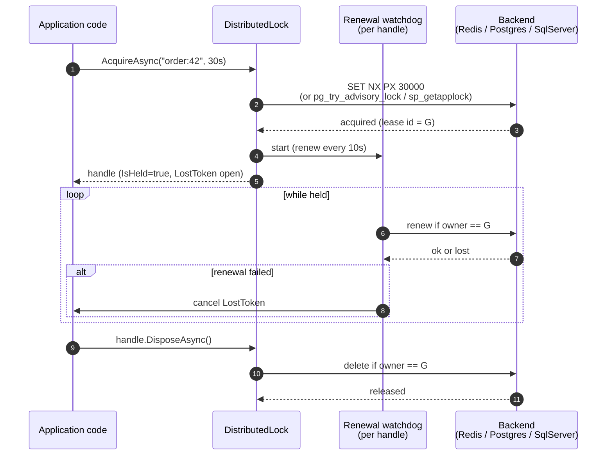

<p align="center">
  
</p>

<h1 align="center">OrionLock</h1>

<p align="center">
  Distributed locking for .NET. A backend-agnostic IDistributedLock with reentrancy, shared/exclusive (reader-writer) locks, and background lease auto-renewal.
</p>

<p align="center">
  <a href="https://www.nuget.org/packages/OrionLock"></a>
  <a href="https://www.nuget.org/packages/OrionLock"></a>
  <a href="LICENSE.txt"></a>
  
</p>

---

## How it works

The acquire path is a single backend call with a generated lease id; the release path validates ownership before deleting the row so two processes cannot accidentally release each other's locks. Between the two, a watchdog renews the lease at one-third of `LeaseDuration` and trips `handle.LostToken` if renewal fails.



The same pattern fits the "single-instance hosted job" recipe: a background service tries to claim a well-known key on its schedule, runs the work if it wins, and goes back to sleep if another replica got there first. Postgres advisory locks make this especially clean because the lock is auto-released on session end if the holding process crashes.


## Quick start

```bash
dotnet add package OrionLock
dotnet add package OrionLock.Redis           # or OrionLock.EntityFrameworkCore
```

```csharp
services.AddOrionLock()
        .UseRedis("localhost:6379");
```

```csharp
await using var handle = await locker.AcquireAsync(
    "order:42",
    new DistributedLockOptions { LeaseDuration = TimeSpan.FromSeconds(30) });
// critical section - handle.LostToken trips if the lease is lost mid-section
```

## Acquire vs TryAcquire

- `AcquireAsync` blocks up to `WaitTimeout` (default 10s). Throws `LockAcquisitionTimeoutException` if it cannot acquire.
- `TryAcquireAsync(key)` is a single attempt. Returns `null` immediately if the lock is held.
- `TryAcquireAsync(key, deadline)` waits until the deadline and returns `null` on expiry instead of throwing. The wait is clamped to the time left so it cannot overshoot by a full retry interval.

```csharp
// Single attempt: null if already held.
await using var first = await locker.TryAcquireAsync("order:42");
if (first is null)
{
    return; // someone else holds it
}

// Bounded wait: poll for up to two seconds, then give up without throwing.
await using var bounded = await locker.TryAcquireAsync("order:42", TimeSpan.FromSeconds(2));
if (bounded is null)
{
    return; // could not acquire within the deadline
}
// critical section
```

## Option validation

`DistributedLockOptions` is validated at every acquire entry point, on your own thread, where the value was set — a non-positive `LeaseDuration`, a negative `WaitTimeout`, a non-positive `RetryInterval` or a non-positive `RenewalFailureGracePeriod` throws `ArgumentOutOfRangeException` instead of surfacing later as a driver error or not at all. A `RetryInterval` longer than `WaitTimeout` is fine: the acquire loop clamps each poll to the remaining budget.

## How a waiter waits

A blocking acquire makes one attempt, and if the lock is held it hands the rest of the wait to the backend through `IDistributedLockProvider.WaitForAcquireAsync`, with the caller's REMAINING budget. What that costs depends on what the store can do:

| Backend | While waiting | Server-side requirement |
| ------- | ------------- | ----------------------- |
| SQL Server | Blocks in SQL Server's own application-lock queue (`sp_getapplock @LockTimeout`), FIFO | none |
| PostgreSQL | Blocks on `pg_advisory_lock`, bounded by `statement_timeout` | none |
| Redis | Subscribes to a per-key release channel the provider publishes to | none; pub/sub only, NOT keyspace notifications |
| etcd | Watches the key for a delete | none |
| Consul | Blocking query on the key's modify index | none |
| ZooKeeper | Watches its immediate predecessor znode, FIFO | none |
| in-memory (`OrionLock.Testing`) | Parks on an in-process release signal | none |
| EF Core, any third-party provider that does not override the member | Polls, exactly as before | none |

This is the **exclusive** `IDistributedLock` path only. `ISharedExclusiveLockProvider` has no
`WaitForAcquireAsync`, so a reader-writer acquire still polls on every backend — see **Shared /
exclusive locks** below.

`OrionLock.Etcd` and `OrionLock.ZooKeeper` ship no package README of their own, so their notes are here. **etcd** watches the lock key and retries when the cluster reports it deleted, which covers both a release and a lease that lapsed under a crashed holder; a failed attempt costs three round trips there, so the watch replaces three per waiter per tick with three once. **ZooKeeper** now runs the real recipe: the ephemeral sequential child is created ONCE and kept, and when it is not the lowest the waiter watches its immediate predecessor. Each position gained costs one children listing plus one watched `exists` - two round trips, against four per tick for the whole wait before - and because the child's sequence number is stable for the whole wait, arrival order is honoured again. The old loop re-created the child every tick, minting a new sequence number each time, which threw the queue away. Neither needs anything configured on the server, and both delete or tear down what they registered on every path that does not win.

`RetryInterval` (default 250 ms) is now the FLOOR of the wait, not the whole of it. A backend that can block or subscribe returns the instant the lock frees and never sleeps an interval at all; the interval still bounds the poll a backend falls back to when it has no better option, or when its subscription drops.

`WaitTimeout`, cancellation and the deadline overloads behave exactly as they always did. A wait that ends early without a grant is not a timeout: the core re-checks the budget, sleeps the retry floor and asks again, so a dropped subscription degrades to polling rather than failing the caller.

`RetryBackoffCeiling` is off by default, which keeps the flat `RetryInterval` every release before 3.0 used. Set it and each fallback poll sleeps a random duration in `[RetryInterval, min(RetryInterval * 2^attempts, ceiling)]` - the randomness is the point, because a flat interval keeps N waiters that arrived together waking on the same tick for the whole queue drain.

**Writing a backend?** `WaitForAcquireAsync` is a default interface method whose default body is that poll loop, so an existing provider needs no change at all. Override it when your store can say "the lock is free now", and report a `LockAcquisition` - a lock taken by waiting carries its fencing token exactly as one taken on the first attempt does, and a wait that drops the token would leave fencing working on an idle key and dark under contention. If you decorate a provider, forward the member: a decorator that does not forward it makes every override below it unreachable. And because it is a default method, a signature that drifts out of step with the contract still compiles and silently stops overriding anything, so a backend is worth one test that asserts it really implements the member.

## Lease and renewal

Each acquired lock carries a lease (default 30s). A background watchdog renews the lease at `LeaseDuration / 3` while the handle is alive. If renewal fails, `handle.IsHeld` flips to false and `handle.LostToken` is cancelled — so the critical section can observe and abort safely instead of running without the lock. See [docs/lease-and-renewal.md](docs/lease-and-renewal.md).

Two other things trip `LostToken`, and both used to be silent:

- **The hold outlived `MaxHoldDuration`** (default ten leases). See **Always dispose the handle** below.
- **`AutoRenew = false` and the lease ran out.** With auto-renew off no watchdog runs, so nothing used to notice the lease expiring: `IsHeld` stayed `true` indefinitely, however long after a TTL backend had expired the key and handed it to someone else. A handle taken with `AutoRenew = false` against a TTL backend now trips `LostToken` and reports `IsHeld = false` once `LeaseDuration` has elapsed, running the same surrender a confirmed loss runs. The session-scoped backends (PostgreSQL, SQL Server, ZooKeeper), where the hold legitimately outlives `LeaseDuration`, are unaffected.

## Fencing tokens

`LostToken` covers the case OrionLock *knows* about: renewal failed, so the lease is gone. It cannot cover the case nothing observes. Your process stops — a stop-the-world GC, a VM migration, a suspended container — for longer than the lease. Nobody's code runs, so nothing notices. The backend expires the key, another process acquires it legitimately, and then your process resumes mid-critical-section and writes. It is not confused: from inside, no time passed. Every lease-based lock has this hole, and the only known fix is a fencing token — a number that strictly increases with each acquisition, which the holder presents to the resource, and which the resource uses to refuse anyone it has already moved past. (Martin Kleppmann, ["How to do distributed locking"](https://martin.kleppmann.com/2016/02/08/how-to-do-distributed-locking.html).)

`handle.FencingToken` is that number. It is `long?`: `null` means this backend has nothing it can make strictly monotonic, and OrionLock reports that honestly instead of inventing a counter you would then trust.

| Backend | Token | Monotonic per key |
| --- | --- | --- |
| `OrionLock.Etcd` | mvcc revision of the acquiring transaction | Yes — always on, no extra round trip |
| `OrionLock.Redis` | `INCR` on a per-key counter, in the same Lua call as the `SET NX PX` | Yes — opt-in (`FencingTokens`), leaves one permanent counter key per lock key |
| `OrionLock.EntityFrameworkCore` | `FencingToken` column, bumped by the same `UPDATE` that takes the row | Yes — needs [a migration](docs/migrations/orionlock-locks-table.md) |
| `OrionLock.Consul` | KV `ModifyIndex` (the Raft log index) | Yes — opt-in (`FencingTokens`), costs one extra GET per acquire |
| `OrionLock.Testing` | in-process per-key counter | Yes, within one process — which is all this backend claims |
| `OrionLock.ZooKeeper` | — | **No.** The sequence number and the parent's `cversion` both reset when the empty parent znode is pruned |
| `OrionLock.SqlServer` | — | **No.** `sp_getapplock` keeps no per-key state to count |
| `OrionLock.Postgres` | — | **No.** `pg_try_advisory_lock` keeps no per-key state to count |

The full reasoning for each verdict — including why Consul's `LockIndex` looks right and is not — is in [docs/fencing-tokens.md](docs/fencing-tokens.md).

### Worked example

The token is worth nothing unless the resource checks it. Acquire, pass it down, and make the resource refuse anything it has already moved past:

```csharp
await using var handle = await locker.AcquireAsync($"order:{orderId}");

// Throws if this backend mints no token, rather than letting a null reach the check below
// and silently compare against nothing.
var fence = handle.RequireFencingToken();

await repository.UpdateStatusAsync(orderId, "shipped", fence);
```

And the part people get wrong — the check has to be **one statement with the write**, not a `SELECT` followed by an `UPDATE`. Two statements can be interleaved by exactly the stale writer you are trying to stop:

```sql
-- One statement: the comparison and the write commit together, or neither happens.
UPDATE orders
   SET status          = @status,
       last_fence      = @fence
 WHERE id              = @orderId
   AND last_fence      <= @fence;  -- reject only a token BELOW the mark; see below
```

```csharp
var rows = await connection.ExecuteAsync(Sql, new { orderId, status, fence });
if (rows == 0)
{
    // Someone with a higher token has already written. We are the paused holder; our lease is
    // gone even though nothing told us. Abandon the work, do not retry.
    throw new StaleFenceException(orderId, fence);
}
```

`last_fence` starts at 0 (or `NOT NULL DEFAULT 0`) so the first write always passes.

Use `<=`, not `<`. What fencing rejects is a token **below** the high-water mark — never one equal to it. The token identifies the *acquisition*, not the write, and it is stable for the whole hold, so a critical section that writes twice presents the same number twice and both writes are the current holder's. `<` would reject the second one and report a stale holder where there is none.

For a resource that genuinely lives in this process, `FencingGuard` does the same bookkeeping in memory:

```csharp
var guard = new FencingGuard();                 // one per resource, long-lived
guard.Accept($"order:{orderId}", fence);        // throws FencingTokenRegressedException if stale
```

It is not a substitute for the SQL above: two application instances would each keep their own idea of the highest token.

The token is also passed to `ILockEventObserver.OnAcquired(key, durationMs, fencingToken)` and attached to the acquire span as `orionlock.fencing_token`. It is deliberately **not** a metric tag — it is unique per acquisition, so as a metric dimension it would mint a fresh time series on every acquire ([docs/lock-key-cardinality.md](docs/lock-key-cardinality.md)).

### Always dispose the handle

Not disposing does not merely leak — it **holds the lock**. The renewal watchdog roots the handle, so a forgotten `await using` is not collected: it keeps renewing the lease, no other process can ever take the key, and on SQL Server and PostgreSQL it pins a dedicated open connection for as long as it runs. The failure is silent, because renewal keeps succeeding.

`DistributedLockOptions.MaxHoldDuration` (default: ten times `LeaseDuration`) is the backstop. Once it elapses the watchdog stops renewing, `handle.IsHeld` goes false, `handle.LostToken` trips, and the hold is released best-effort — so the key comes back even on the session-scoped backends, where merely not renewing would free nothing. Raise it for a genuinely long critical section; it is a leak backstop, not a work deadline.

## Exceptions

An acquire on `IDistributedLock` raises only these, whichever backend is registered:

| Exception | When |
| --- | --- |
| `ArgumentException` | the key is not a legal lock key (see **Lock keys**). Thrown synchronously, on your own thread. |
| `ArgumentOutOfRangeException` | a `DistributedLockOptions` value is out of range, or `LeaseDuration` is below what the backend can honour. Also synchronous. |
| `LockAcquisitionTimeoutException` | `AcquireAsync` only, on `WaitTimeout`. The `TryAcquireAsync` overloads return `null` instead. |
| `OrionLockBackendException` | the backend failed for a reason that is not contention. |
| `OperationCanceledException` | your cancellation token was cancelled. |
| `InvalidOperationException` | an OrionLock invariant, in practice only the ownerToken collision SQL Server and PostgreSQL detect. |

**Driver exceptions do not escape.** A `SqlException`, `PostgresException`, `RpcException`, `KeeperException`, `RedisException`, `DbException` or HTTP failure is wrapped in `OrionLockBackendException` at the lock's provider boundary, with the original as `InnerException` — so `catch (OrionLockBackendException)` works without referencing any backend's driver package, and stays correct when you switch backends. The wrapping is installed by `DistributedLock` itself, so it holds whether the lock came from `AddOrionLock` or from `new DistributedLock(provider)`.

A lease lost *after* acquisition is not an exception from these methods. `handle.IsHeld` and `handle.LostToken` report it; `handle.ThrowIfLost()` turns it into `LeaseLostException` at a point in the critical section you choose — typically just before the write the lock was taken to protect.

## Reentrancy

Reentrancy is scoped to **the flow that holds the lock**, not to the key. An acquire establishes an owner identity in the calling flow (an `AsyncLocal` scope, like `Activity.Current`), and only a re-acquire from inside that same flow — including one made deeper in the call stack, after any number of `await`s — collapses into a counted nested handle without touching the backend. The outermost dispose releases. Any other caller goes to the backend and contends normally.

The scope belongs to the hold: work forked off *during* the critical section inherits it and still re-enters; work forked after the handle was released does not, and neither does work started from an independent context. Reentrancy never crosses process boundaries.

> **Changed in 3.0.0.** Reentrancy used to be keyed on the lock key alone. Because `AddOrionLock` registers `IDistributedLock` as a singleton, two *unrelated* callers on that one instance — two concurrent HTTP requests, say — both got a handle for the same key: the second was handed a nested handle over the first one's lease, the backend was never consulted, and both ran inside the critical section at once. If you have in-process callers that were silently sharing a lease this way, they now block against each other, so `AcquireAsync` can throw `LockAcquisitionTimeoutException` where it previously returned immediately.

## Lock keys

A key is **one opaque name**, the same on every backend. `LockKey.Validate` runs in the core before any backend sees the key, and throws `ArgumentException` on your own thread at acquire time — not later, as a driver error from whichever server happened to mind. It refuses:

- **`/`.** The key is caller data that two backends splice into a namespace they do not own: Consul builds `/v1/kv/{key}` out of it and ZooKeeper builds a znode path. A `/` used to mean "hierarchy" there and nothing on the other five, so the same key addressed different things depending on the registration. Express hierarchy through the backend's own namespace knob — `RedisLockOptions.KeyPrefix`, `ConsulLockOptions.KeyPrefix`, `SqlServerLockOptions.KeyPrefix`, `PostgresLockOptions.KeyPrefix`, `EtcdLockOptions.KeyPrefix`, `ZooKeeperLockOptions.RootPath` — which every backend already has.
- **`.` and `..`**, which URI and znode canonicalisation resolve. This cannot be delegated to encoding: .NET unescapes `%2E` back to `.`, so `..` survives percent-encoding and still collapses.
- **Control characters** (`U+0000`–`U+001F`, `U+007F`–`U+009F`) and the ranges ZooKeeper refuses in a znode name (`U+D800`–`U+F8FF`, `U+FFF0`–`U+FFFF`), so a key fails fast and identically everywhere rather than at one server.
- **Keys longer than `LockKey.MaxLength` (200)** — the bound the EF Core row maps `Key` at, and small enough to fit SQL Server's `sp_getapplock` `@Resource` budget with a prefix.

The core validates and rejects; it does not encode. A URI path, a znode name and a Redis key are different alphabets, so each backend encodes what remains for its own wire format.

**The prefix is held to the same rule, at registration time.** `ConsulLockOptions.KeyPrefix` and `ZooKeeperLockOptions.RootPath` are concatenated into the same path the key is, so a prefix of `"../session/destroy/"` with a perfectly legal key still canonicalises out of the KV namespace — the traversal the key rule exists to stop, arriving through the half of the path the key rule cannot see. Both are validated per segment when you build the host, so a bad prefix fails at startup naming `KeyPrefix` / `RootPath` rather than at the first acquire. The backends that pass their prefix as a protocol field or a SQL parameter (Redis, etcd, SQL Server, PostgreSQL, EF Core) are unaffected.

## Shared / exclusive (reader-writer) locks

Added in v0.4.0. `ISharedExclusiveLock` is a reader-writer lock for a resource key: any number of `Shared` (read) holders coexist, OR exactly one `Exclusive` (write) holder owns it. Acquire, `WaitTimeout`/`RetryInterval`, lease and renewal, release, and diagnostics semantics mirror the exclusive `IDistributedLock`, and every acquire returns the same `IDistributedLockHandle`.

That mirroring is literal, not aspirational: both handles drive the same internal lease watchdog, so a reader-writer hold emits the same instruments in the same order as an exclusive one and fires the same `ILockEventObserver` callbacks. A parity test drives every lifecycle — renewal, backend-confirmed loss, exhausted renewal grace, TTL expiry — through both and fails if they ever diverge. An `ILockEventObserver` registered in DI reaches reader-writer holds too: the Redis, PostgreSQL, EF Core and in-memory registrations resolve it and hand it to the lock. Constructing `new SharedExclusiveLock(provider, observer)` by hand is for callers who build the lock themselves.

Three documented exceptions to the mirroring:

- **Reentrancy is not modelled** for reader-writer holds; each acquire takes a fresh backend hold.
- **The FIFO waiter coordinator is exclusive-only.**
- **A reader-writer acquire still polls.** `ISharedExclusiveLockProvider` has no `WaitForAcquireAsync`, so none of the backend-side waiting described in **How a waiter waits** applies here: a contended reader-writer acquire sleeps `RetryInterval` (jittered, if you set `RetryBackoffCeiling`) and re-attempts. That also means `orion.lock.acquire.attempt_count` keeps its old meaning on this path while the exclusive path collapses towards 2 per acquire, so the two are not comparable and should not share a chart. The acquire span tells them apart: a reader-writer acquire tags its span `orionlock.mode` (`Shared` / `Exclusive`) and an exclusive one does not set the tag at all. The metric itself carries no such dimension — `attempt_count` is recorded from one instrument on both paths — so if you need to separate them in metrics rather than traces, record the two workloads under different meter views or keep them on separate services.

`UseInMemory()` from `OrionLock.Testing` registers `ISharedExclusiveLock`, so it resolves from DI like the exclusive lock:

```csharp
var rwLock = serviceProvider.GetRequiredService<ISharedExclusiveLock>();

// Many readers can hold the key at once.
await using (var read = await rwLock.AcquireSharedAsync("catalog:42"))
{
    // shared critical section - read.LostToken trips if the lease is lost
}

// A single writer excludes all readers and other writers.
await using (var write = await rwLock.AcquireExclusiveAsync("catalog:42"))
{
    // exclusive critical section
}
```

Blocking `AcquireSharedAsync` / `AcquireExclusiveAsync` wait up to `WaitTimeout` and throw `LockAcquisitionTimeoutException` on timeout. The non-blocking `TryAcquireSharedAsync` / `TryAcquireExclusiveAsync` make a single attempt and return `null` when the key is held in a conflicting mode.

`TryAcquireSharedAsync` / `TryAcquireExclusiveAsync` also take an optional deadline, the reader-writer counterpart of `TryAcquireAsync(key, deadline)`: they poll until the deadline and return `null` on expiry instead of throwing.

```csharp
await using var write = await rwLock.TryAcquireExclusiveAsync("catalog:42", TimeSpan.FromSeconds(2));
if (write is null)
{
    return; // readers (or another writer) did not drain within the deadline
}
```

The reader-writer lock runs distributed on Redis, PostgreSQL, and any EF Core relational provider. Each registration is additive to the exclusive-only registration of the same backend:

```csharp
services.AddOrionLock()
    .UseRedis("localhost:6379")        // exclusive IDistributedLock
    .UseRedisSharedExclusive();        // reader-writer ISharedExclusiveLock over Redis

// or PostgreSQL:
services.AddOrionLock()
    .UsePostgres(connectionString)
    .UsePostgresSharedExclusive(connectionString);

// or any EF Core relational provider (SQL Server, PostgreSQL, and so on):
services.AddOrionLock()
    .UseEntityFrameworkCore<AppDbContext>()
    .UseEntityFrameworkCoreSharedExclusive<AppDbContext>();
```

Every distributed reader-writer provider keeps a writer marker, a per-reader record scored or stamped by lease expiry (so one reader's expiry never frees another's), and a lease-bounded pending-writer marker that holds off new readers so a waiting writer is not starved. The Redis provider does this with Lua scripts and a sorted set; the PostgreSQL provider with clock-leased rows serialized by `pg_advisory_xact_lock`; the EF Core provider with clock-leased rows in a serializable transaction. The remaining backends (SqlServer's `sp_getapplock`, Consul, Etcd, ZooKeeper) keep the exclusive lock only. See the runnable section in `demo/Moongazing.OrionLock.Demo`.

## Choosing a backend

All backends implement the same `IDistributedLock`, so application code compiles unchanged when you switch; only the registration does. Pick the in-memory backend for tests, then a distributed backend for production.

**`LeaseDuration` is where the backends genuinely differ, so it is not portable in the way the rest of the API is.** It decides how long another process waits to take over after this one crashes, and each backend can honour a different range of it. Rather than raising a lease it cannot honour behind your back, a backend now advertises a floor and the core throws `ArgumentOutOfRangeException` at acquire time; what the backend *will* honour is on the handle as `EffectiveLeaseDuration`.

| Backend | Shortest lease it can honour | `handle.EffectiveLeaseDuration` |
| --- | --- | --- |
| Redis | 1 ms | rounded **up** to a whole millisecond, which is all `PX` / `PEXPIRE` take |
| EF Core, in-memory | 1 tick | the lease you asked for (on EF Core, subject to the mapped column's precision) |
| Consul | `ConsulLockOptions.MinSessionTtl`, default **10 s** (Consul's own floor) | the lease you asked for |
| etcd | `EtcdLockOptions.MinLeaseTtlSeconds`, default **5 s** | rounded **up** to a whole second |
| PostgreSQL, SQL Server, ZooKeeper | any — the hold is session-scoped, not leased | `Timeout.InfiniteTimeSpan`: no wall clock bounds the hold; it lives until release or session loss |

```csharp
await using var handle = await locker.AcquireAsync(
    "order:42", new DistributedLockOptions { LeaseDuration = TimeSpan.FromSeconds(2) });

// Assert on what you actually got, rather than on what you asked for.
Assert.Equal(TimeSpan.FromSeconds(2), handle.EffectiveLeaseDuration);
```

```csharp
using Microsoft.Extensions.DependencyInjection;
using Moongazing.OrionLock;

// In-memory (tests, single process) - no Redis or DB required.
services.AddOrionLock().UseInMemory();                          // OrionLock.Testing

// Redis - SET NX PX acquire, clock-leased, owner-checked Lua release.
services.AddOrionLock().UseRedis("localhost:6379");             // OrionLock.Redis

// PostgreSQL - native pg_try_advisory_lock, session-scoped, crash-safe.
services.AddOrionLock().UsePostgres(connectionString);          // OrionLock.Postgres

// Resolve and use the same way regardless of backend:
var locker = serviceProvider.GetRequiredService<IDistributedLock>();
await using var handle = await locker.AcquireAsync(
    "order:42",
    new DistributedLockOptions { LeaseDuration = TimeSpan.FromSeconds(30) });
// critical section
```

## Backends

- **`OrionLock.Redis`** — `SET NX PX` acquire, owner-checked Lua renew/release. Single Redis endpoint (single-instance lock; multi-master RedLock is a separate opt-in). Also ships the distributed reader-writer lock (`UseRedisSharedExclusive()`): a Lua-scripted writer marker plus a per-reader sorted set scored by lease expiry, with a lease-bounded pending-writer marker for writer fairness.
- **`OrionLock.EntityFrameworkCore`** — provider-agnostic `OrionLock_Locks` table; PostgreSQL, SQL Server, MySQL, SQLite. Also ships the provider-portable reader-writer lock (`UseEntityFrameworkCoreSharedExclusive<TDbContext>()`) over clock-leased rows in a serializable transaction. See [docs/migrations/orionlock-locks-table.md](docs/migrations/orionlock-locks-table.md).
- **`OrionLock.SqlServer`** — native `sp_getapplock` with session-scope lifetime. Crash-safe (no clock-based expiry; SQL Server releases the lock when the session ends) and faster than the EF Core lock table on SQL Server.
- **`OrionLock.Postgres`** — native `pg_try_advisory_lock` with session-scope lifetime, crash-safe with the same rationale as SqlServer. Also ships the distributed reader-writer lock (`UsePostgresSharedExclusive()`) over clock-leased rows serialized by `pg_advisory_xact_lock`.
- **`OrionLock.Testing`** — in-memory provider for tests, no Redis or DB required.

Those five, plus the core `OrionLock` package, are the six that ship to nuget.org.

### Not published: Consul, etcd, ZooKeeper, health checks

`OrionLock.Consul`, `OrionLock.Etcd`, `OrionLock.ZooKeeper` and `Moongazing.OrionLock.HealthChecks` live in this repository, build in this solution and are documented throughout this README, but they are **not on nuget.org** and never have been. They sit at 0.7.0 while the published packages are at 3.0.0, and the release job does not pack them.

The reason is test coverage, not readiness. **The three backends have no container test coverage at all** — their test projects carry no Testcontainers reference, no fixture and no CI service, so every test in them runs against a fake adapter. The etcd watch, the Consul blocking query, the ZooKeeper predecessor watch, the fencing verdicts, the round-trip counts: all of it is proven at fake level only, and none of those providers has ever executed against a real etcd cluster, Consul agent or ZooKeeper ensemble. A distributed lock is exactly the kind of component where the gap between "the fake agrees" and "the server agrees" is where the bugs live, so shipping one on that basis is not something to do quietly.

`Moongazing.OrionLock.HealthChecks` holds no lock semantics of its own — it probes whichever backend is registered — but its suite has no Testcontainers reference either: it has only ever probed the in-memory provider and throwing fakes.

Use them by project reference if you want them, with that caveat in mind. They will be published when a container suite exists for them.

### Exactly one backend

Every backend registers through the same `OrionLockBuilder.UseBackend(name, factory)`, so they all behave identically: one `IDistributedLock`, one backend. Asking for a second one on the same builder throws `InvalidOperationException` naming both, rather than silently picking one:

```csharp
services.AddOrionLock().UseInMemory().UseRedis("localhost:6379"); // throws
```

Re-registering the *same* backend replaces it, so a later `UseRedis(...)` with different options wins as you would expect. To override deliberately — a test host replacing the production registration — start a fresh builder with another `AddOrionLock()` call.

## Trimming and Native AOT

OrionLock's own surface uses no dynamic code generation; the only reflection in the core reads assembly and attribute metadata for telemetry, which is trimmer- and AOT-safe. The posture below reflects what each package's dependencies allow.

| Package | Trimmable / AOT-compatible | Notes |
| --- | --- | --- |
| `OrionLock` (core) | Yes | `IsTrimmable` and `IsAotCompatible` set; built clean with the trim and AOT analyzers. |
| `OrionLock.Testing` | Yes | In-memory provider only; `IsTrimmable` and `IsAotCompatible` set. |
| `OrionLock.Redis` | Not claimed | Depends on `StackExchange.Redis`, which is not annotated AOT-safe. |
| `OrionLock.EntityFrameworkCore` | Not claimed | EF Core model building uses dynamic code; not Native AOT compatible. |
| `OrionLock.SqlServer` | Not claimed | Depends on `Microsoft.Data.SqlClient`, which is not annotated AOT-safe. |
| `OrionLock.Postgres` | Not claimed | Depends on the `Npgsql` driver; not claimed AOT-safe at this time. |

For a Native AOT or aggressively trimmed application, reference the core and (in tests) the Testing package directly; the database and Redis backends carry their drivers' trimming posture, so build them with the trim warnings on and validate against your own configuration.

## Health checks

`Moongazing.OrionLock.HealthChecks` ([unpublished](#not-published-consul-etcd-zookeeper-health-checks)) ships an `IHealthCheck` that probes backend reachability by acquiring and releasing a sentinel lock. Register it via `services.AddHealthChecks().AddOrionLockHealthCheck(name: "orionlock", failureStatus: HealthStatus.Degraded, tags: ["ready", "infra"])`. The probe returns `Healthy` on success, `Degraded` when the sentinel is contended within `WaitTimeout`, and `Unhealthy` when the backend throws. Useful for failing fast in container readiness probes when Redis or the database is unreachable.

## OpenTelemetry

`ActivitySource` and `Meter` named `Moongazing.OrionLock`. Each acquire opens a span tagged with the key and outcome, plus `orionlock.fencing_token` when the backend mints one. Counters: `orion.lock.acquisitions`, `orion.lock.contentions`, `orion.lock.lease.lost`, `orion.lock.lease.expired_before_release`, `orion.lock.lease.grace_period_exhausted`, `orion.lock.health_check.result` (tagged by `result`). Up-down counters: `orion.lock.leases.held_concurrent`, `orion.lock.reentrancy.depth`. Histograms: `orion.lock.acquire.duration` (end-to-end blocking-acquire time), `orion.lock.acquire.latency` (single backend round-trip, tagged by `backend`), `orion.lock.lease_renewal.duration` (per-renewal time, tagged by `backend`), `orion.lock.acquire.attempt_count`, `orion.lock.handle.renewals_per_hold`, `orion.lock.lease.renewal_failures_consecutive`. See [docs/lock-key-cardinality.md](docs/lock-key-cardinality.md) before sending high-cardinality lock keys through the meter.

**Two things about 3.0.0 will move your charts.** `orion.lock.acquire.attempt_count` on the exclusive path now counts the attempts the core issued, which for a backend that blocks or subscribes collapses towards 2 per acquire — the reduction is the win, stated in the metric rather than hidden by it. And a reader-writer hold now emits the renewal, grace, attempt and `renewals_per_hold` instruments and fires `ILockEventObserver`, none of which it ever did, so alerts on those instruments will start seeing traffic they never saw. Re-baseline both.

## Benchmarks

See [benchmarks.md](benchmarks.md) for the BenchmarkDotNet harness in `bench/Moongazing.OrionLock.Benchmarks`, the scenarios it covers (uncontended in-memory acquire/release as the abstraction-cost floor), and the comparison baselines we report against. The Redis and Postgres backends ship as packages but are exercised by the integration tests rather than the benchmark harness.

## Roadmap

The current release is **3.0.0**, and unlike 2.0.0 — which was a telemetry-only rename — this one genuinely breaks code. The surface is still guarded by `Microsoft.CodeAnalysis.PublicApiAnalyzers` with per-project `PublicAPI.Shipped.txt` baselines, and the breaks are deliberate:

- lock keys are validated in the core and `/` is no longer legal in one;
- registering two different backends on one builder throws;
- `UseRedis(connectionString)` now connects with that connection string;
- a `LeaseDuration` below the backend's floor is refused rather than silently raised;
- `IDistributedLockHandle.EffectiveLeaseDuration` is a new abstract member;
- driver exceptions are wrapped in `OrionLockBackendException`;
- `MaxHoldDuration` bounds the renewal watchdog at ten leases by default;
- reentrancy is scoped to the holding flow rather than the key.

The [changelog](CHANGELOG.md) opens 3.0.0 with the full breaking-change list and what to do about each. Forward plan in [ROADMAP.md](ROADMAP.md): fair queueing beyond opt-in FIFO, a distributed counter/sequence primitive, and container suites for the three unpublished backends. If something on the list matters to you, open an issue with the `roadmap` label.

## More from the Orion family

- [OrionGuard](https://github.com/tunahanaliozturk/OrionGuard) — validation, guard clauses, DDD primitives, domain events
- [OrionKey](https://github.com/tunahanaliozturk/OrionKey) — source-generated strongly-typed IDs
- [OrionAudit](https://github.com/tunahanaliozturk/OrionAudit) — automatic EF Core change-audit trail
- [OrionPatch](https://github.com/tunahanaliozturk/OrionPatch) — transactional outbox for EF Core (enqueue inside SaveChanges, dispatch at-least-once through a pluggable sink)

### See it in a real app

[Moongazing.OrionShowcase](https://github.com/tunahanaliozturk/OrionShowcase) is a production-shaped banking sample integrating all six Orion packages end-to-end. OrionLock.Postgres backs two patterns in the showcase: sorted-key deadlock-free distributed locks in TransferMoneyHandler and single-instance gating for the DailySettlementService background job. Concrete usage:

- [src/Moongazing.OrionShowcase.Application/Accounts/Commands/TransferMoney/TransferMoneyHandler.cs](https://github.com/tunahanaliozturk/OrionShowcase/blob/main/src/Moongazing.OrionShowcase.Application/Accounts/Commands/TransferMoney/TransferMoneyHandler.cs)
- [src/Moongazing.OrionShowcase.Infrastructure/HostedServices/DailySettlementService.cs](https://github.com/tunahanaliozturk/OrionShowcase/blob/main/src/Moongazing.OrionShowcase.Infrastructure/HostedServices/DailySettlementService.cs)

## Contributing

Issues and pull requests welcome. Please read [CONTRIBUTING.md](CONTRIBUTING.md) and the [Code of Conduct](CODE_OF_CONDUCT.md) before opening one.

## License

MIT. See [LICENSE.txt](LICENSE.txt).
